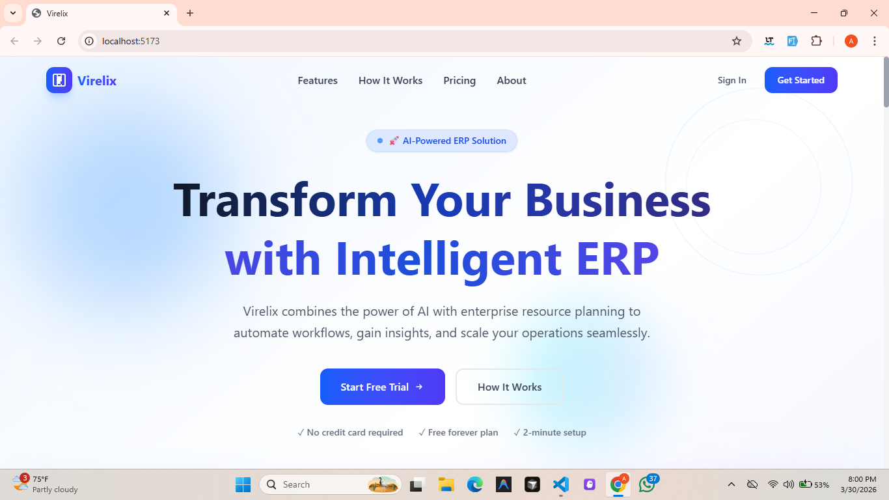
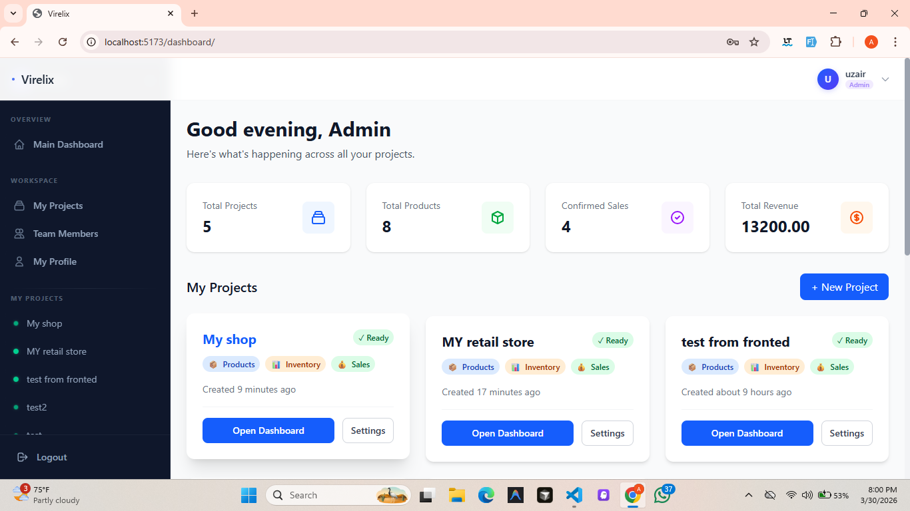
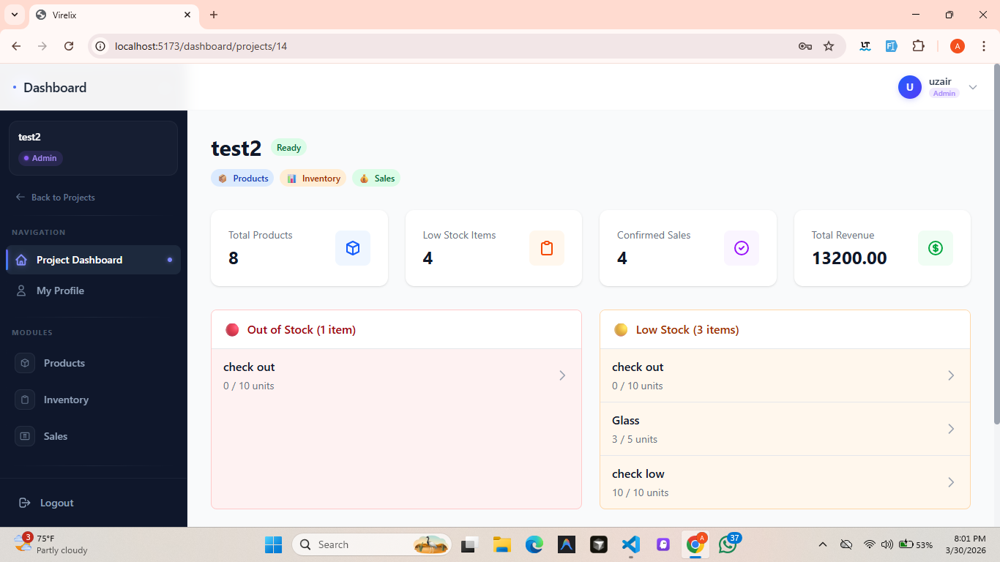
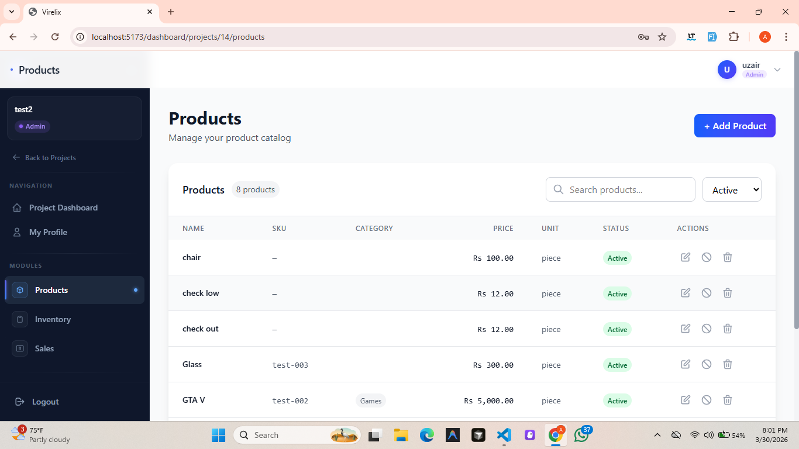
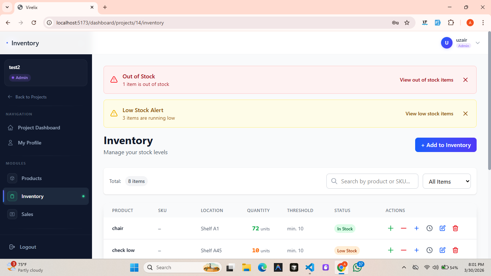
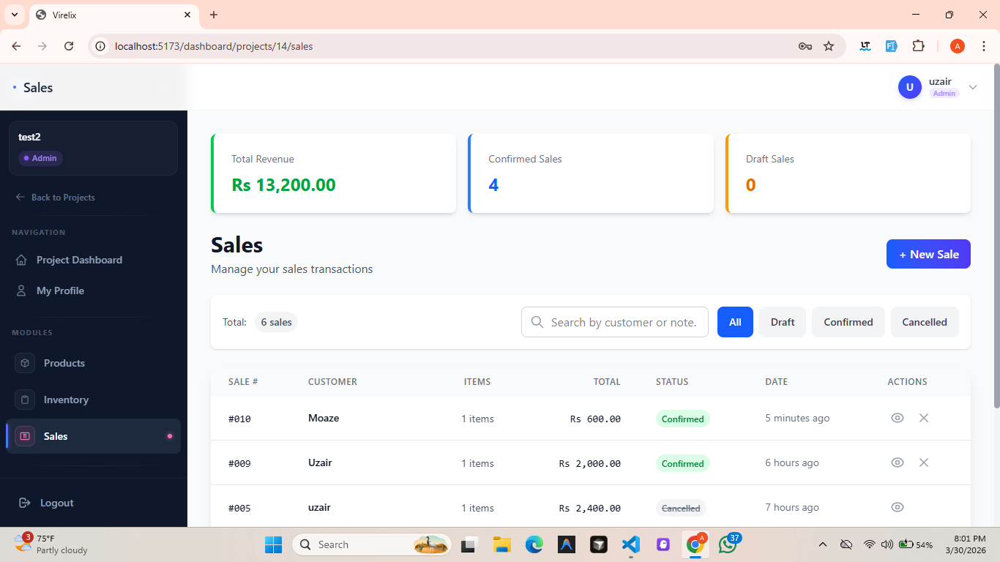

# 🚀 Virelix - AI-Powered ERP System

[](https://python.org)
[](https://djangoproject.com)
[](https://reactjs.org)
[](https://tailwindcss.com)
[](https://postgresql.org)
[](https://redis.io)

Virelix is an intelligent, AI-powered Enterprise Resource Planning (ERP) system that automatically configures itself based on your business description. Say goodbye to manual module configuration - let AI understand your business needs and set up the perfect ERP system for you.



## ✨ Features

### 🤖 AI-Powered Module Configuration
- Describe your business in plain English
- AI automatically determines which modules you need (Products, Inventory, Sales)
- No manual configuration required

### 📦 Complete ERP Modules
- **Products Management** - Full CRUD operations with SKU tracking, categories, and pricing
- **Inventory Management** - Stock tracking, low stock alerts, movement history, stock adjustments
- **Sales Management** - Create sales, confirm orders, automatic inventory deduction, sales history

### 👥 Role-Based Access Control
- **Admin** - Full system access, project management, team management, all settings
- **Manager** - Operational access, can create/update products, manage inventory, process sales
- **Staff** - Limited read access with basic operations (view products, process sales)

### 📊 Intelligent Dashboards
- **Admin Dashboard** - Cross-project analytics, alerts, and overview across all projects
- **Project Dashboard** - Project-specific metrics, module access, and real-time stats

### 🔐 Enterprise Security
- JWT-based authentication with automatic token refresh
- Project-level data isolation (no cross-project data access)
- Encrypted sensitive data (Gemini API keys using Fernet encryption)
- Role-based permissions for every action

### ⚡ Real-time Features
- Live stock level updates
- Automatic inventory deduction on sales confirmation
- Background job processing with Celery
- Real-time low stock alerts

## 📸 Screenshots

### Landing Page


### Admin Dashboard


### Project Dashboard


### Products Management


### Inventory Management


### Sales Management


## 🏗️ Architecture Overview


┌─────────────────────────────────────────────────────────────────┐
│ Frontend (React + Vite) │
│ ┌──────────┐ ┌──────────┐ ┌──────────┐ ┌──────────┐ ┌────────┐│
│ │ Admin │ │ Project │ │ Products │ │Inventory │ │ Sales ││
│ │Dashboard │ │Dashboard │ │ Page │ │ Page │ │ Page ││
│ └──────────┘ └──────────┘ └──────────┘ └──────────┘ └────────┘│
│ ┌──────────────────────────────────────────────────────────────┐│
│ │ Zustand Store (State Management) ││
│ └──────────────────────────────────────────────────────────────┘│
└─────────────────────────────┬───────────────────────────────────┘
│ HTTP/REST API + JWT Auth
▼
┌─────────────────────────────────────────────────────────────────┐
│ Backend (Django REST Framework) │
│ ┌────────────┐ ┌────────────┐ ┌────────────┐ ┌──────────────┐ │
│ │ Accounts │ │ Projects │ │ Products │ │ Inventory │ │
│ │ API │ │ API │ │ API │ │ API │ │
│ └────────────┘ └────────────┘ └────────────┘ └──────────────┘ │
│ ┌────────────┐ ┌────────────────────────────────────────────┐ │
│ │ Sales │ │ AI Agent (OpenAI SDK) │ │
│ │ API │ │ └── Gemini Flash 2.5 LLM │ │
│ └────────────┘ └────────────────────────────────────────────┘ │
└─────────────┬───────────────────┬───────────────────────────────┘
│ │
▼ ▼
┌──────────────────┐ ┌──────────────────────────┐
│ PostgreSQL │ │ Redis + Celery │
│ Database │ │ (Background Tasks) │
│ │ │ - AI Analysis │
│ - Data Isolation │ │ - Low Stock Detection │
│ - Row-level │ │ - Automated Alerts │
│ Security │ │ │
└──────────────────┘ └──────────────────────────┘


## 🤖 AI Workflow Explanation

Virelix uses Google's Gemini AI (via OpenAI SDK agent with Gemini Flash 2.5 as LLM) to intelligently configure ERP modules based on your business description:

### Step-by-Step AI Analysis Process:
Step 1: User creates a project with business description
↓
Step 2: System dispatches Celery task for AI analysis
↓
Step 3: AI Agent (Gemini Flash 2.5) reads and analyzes business description
↓
Step 4: AI decides which modules are needed:
• Products Module? (if business sells/manages items)
• Inventory Module? (if stock tracking is required)
• Sales Module? (if transactions are processed)
↓
Step 5: System updates project with enabled modules
↓
Step 6: User sees configured modules in dashboard
↓
Step 7: User can now access enabled modules


### Example AI Decisions:

| Business Description | Products | Inventory | Sales |
|---------------------|----------|-----------|-------|
| "I run a retail clothing store that sells products and manages inventory" | ✅ | ✅ | ❌ |
| "We provide consulting services with invoicing" | ❌ | ❌ | ✅ |
| "E-commerce business selling electronics with stock tracking" | ✅ | ✅ | ✅ |
| "Restaurant with dine-in and takeaway orders" | ✅ | ✅ | ✅ |

## 🛠️ Tech Stack

### Backend
| Technology | Version | Purpose |
|------------|---------|---------|
| Python | 3.14+ | Core programming language |
| Django | 6.0 | Web framework |
| Django REST Framework | 3.17 | REST API development |
| Celery | 5.6 | Background task processing |
| Redis | 7.4 | Message broker & caching |
| PostgreSQL | Latest | Production database |
| django-cors-headers | 4.9 | CORS handling |
| djangorestframework-simplejwt | 5.5 | JWT authentication |
| cryptography | 46.0 | Data encryption |
| google-generativeai | 0.8 | Gemini AI integration |
| openai-agents | 0.13 | AI agent framework |

### Frontend
| Technology | Version | Purpose |
|------------|---------|---------|
| React | 19 | UI framework |
| Vite | 8 | Build tool & dev server |
| Tailwind CSS | 4 | Utility-first styling |
| Zustand | 5 | State management |
| Axios | 1.14 | HTTP client |
| React Router DOM | 7 | Client-side routing |
| date-fns | 4 | Date formatting |

## 📋 Prerequisites

Before you begin, ensure you have the following installed:

- **Python** 3.14 or higher
- **Node.js** 25+ and **npm** 11+
- **PostgreSQL** database server
- **Redis** server (for Celery background tasks)
- **Google Gemini API key** (get from [Google AI Studio](https://aistudio.google.com/))

## 🚀 Setup Instructions

### 1. Clone the Repository

```bash
git clone https://github.com/Uzair-Waseem-390/Virelix.git
cd Virelix
